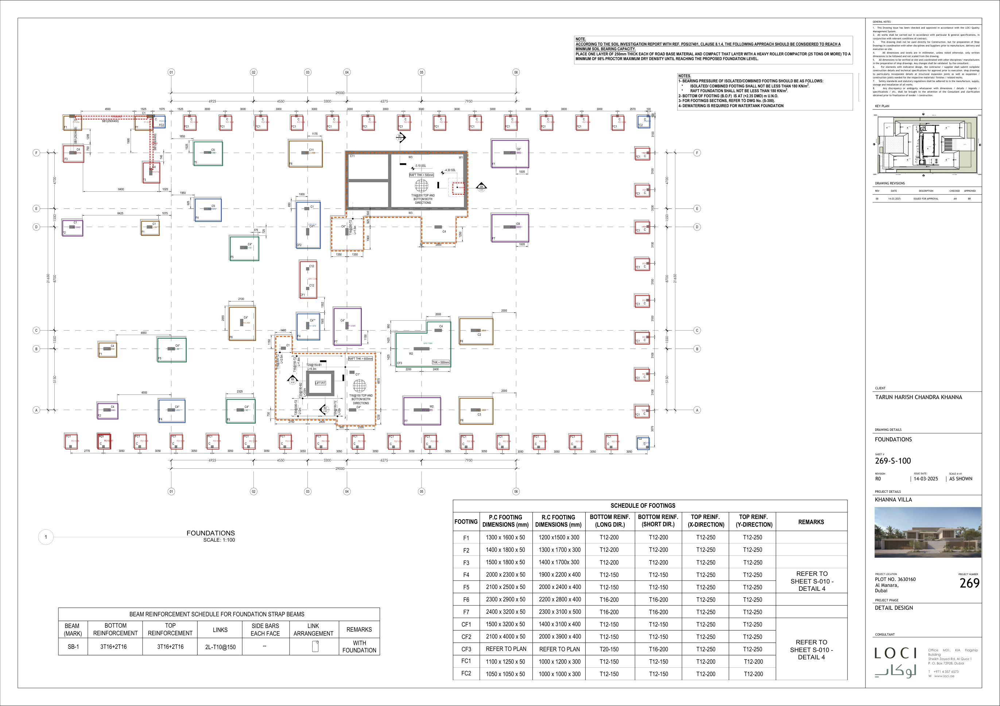

# Foundations takeoff

Khanna Villa, sheet 269-S-100. Quantities are read from the DWG. The PDF is only the background.

Coloured boxes are the footings, labelled with the schedule tag and the concrete volume in m³. The dashed outline is the raft.

## Bill comparison

Bill No. 2, Section C. Difference is ours minus the bill.

| Item | Unit | Bill | Ours | Difference | % | Note |
|---|---|---:|---:|---:|---:|---|
| Footing concrete | m³ | 67 | 67.22 | +0.22 | +0.3 | Schedule depth. CF3 uses 400 mm, the same as the other CF footings |
| Footing formwork | m² | 143 | 144.21 | +1.21 | +0.8 | Perimeter times schedule depth |
| Footing reinforcement | kg | 5,879 | 5,943.5 | +64.5 | +1.1 | Bars spaced inside a 75 mm cover. No hooks or laps |
| Raft concrete | m³ | 65 | 65.23 | +0.23 | +0.4 | Outer foundation outline around the raft note, including the side bays |
| Raft formwork | m² | 41 | 41.02 | +0.02 | 0.0 | Edge of that outline times thickness |
| Raft reinforcement | kg | 5,608 | 5,537.9 | −70.1 | −1.3 | T16 note inside each raft: top and bottom, both directions |
| Blinding, 50 mm | m³ | 46 | 45.98 | −0.02 | −0.1 | From 269-S-001: 50 mm grade C12/15 under foundations, ground beams and ground slabs. Footing pads from the S-100 schedule (9.00 m³). Slab on grade 600 m². Raft beds 140 m². |

The thickness is not assumed. `269-S-001` says foundations, ground beams and ground slabs sit on a minimum of 50 mm grade C12/15 blinding, unless a drawing says otherwise. The footing schedule on `269-S-100` is the exception: each tag has its own pad. The slab outline is on the ground-floor sheet (600 m²) and the raft beds are the plain-concrete outlines on the foundations sheet (140 m²). 600 m² and 140 m² at 50 mm is 37.0 m³, plus the 9.00 m³ of pads, which is 45.98 m³.

## Takeoff by tag

| Tag | Count | Concrete m³ | Blinding m³ | Formwork m² | Reinforcement kg |
|---|---:|---:|---:|---:|---:|
| F7 | 4 | 14.26 | 1.54 | 21.60 | 1,190.4 |
| FC1 | 38 | 13.73 | 2.62 | 50.25 | 1,590.0 |
| F6 | 4 | 9.86 | 1.34 | 16.00 | 1,061.2 |
| F5 | 4 | 7.68 | 1.05 | 14.08 | 678.0 |
| CF3 | 1 | 6.00 | — | 6.72 | — |
| F4 | 3 | 5.02 | 0.69 | 9.84 | 433.2 |
| CF2 | 1 | 3.12 | 0.42 | 4.72 | 278.1 |
| F1 | 4 | 2.16 | 0.42 | 6.48 | 202.8 |
| CF1 | 1 | 1.74 | 0.24 | 3.60 | 149.8 |
| F3 | 2 | 1.43 | 0.27 | 3.72 | 138.4 |
| F2 | 2 | 1.33 | 0.25 | 3.60 | 122.0 |
| FC2 | 3 | 0.90 | 0.17 | 3.60 | 99.6 |
| **Total** | **67** | **67.22** | **9.00** | **144.21** | **5,943.5** |

The 9.00 m³ column is the pads only. The bill line, 45.98 m³, is those pads plus the slab and the raft beds.

CF3 is on the drawing and in the concrete total. The schedule says “refer to plan” and gives no bar size for a known plan area, so its reinforcement is left out.

FC1 outlines on the drawing are the 1,100 × 1,250 blinding pad. The reinforced footing in the schedule is 1,000 × 1,200 × 300. Concrete for those uses the schedule size, 0.36 m³ each.

## Files

- `foundations-identified.png`
- `269-S-100-FOUNDATIONS-overlay.pdf`
- `269-S-100-FOUNDATIONS-foundations.csv`
- `foundations-compare.csv`
